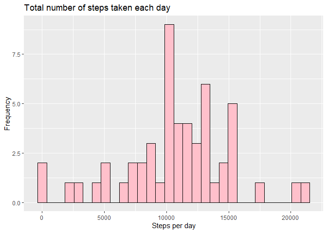
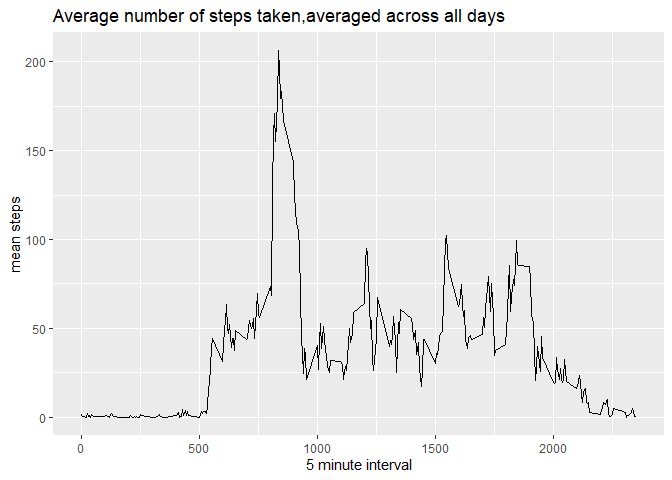
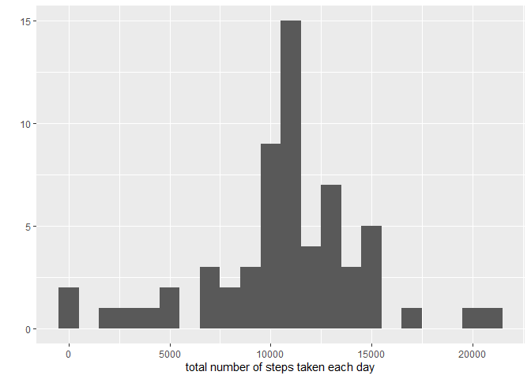
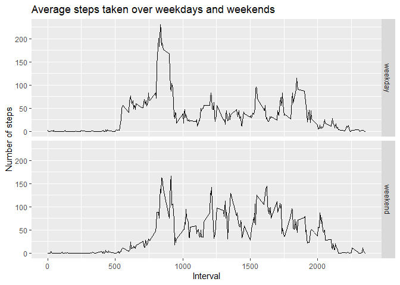

## Loading and preprocessing the data

```r
library(ggplot2)
library(dplyr)
```

```
## 
## Attaching package: 'dplyr'
```

```
## The following objects are masked from 'package:stats':
## 
##     filter, lag
```

```
## The following objects are masked from 'package:base':
## 
##     intersect, setdiff, setequal, union
```

```r
library(Hmisc)
```

```
## Loading required package: lattice
```

```
## Loading required package: survival
```

```
## Loading required package: Formula
```

```
## 
## Attaching package: 'Hmisc'
```

```
## The following objects are masked from 'package:dplyr':
## 
##     src, summarize
```

```
## The following objects are masked from 'package:base':
## 
##     format.pval, units
```

```r
data <- read.csv("./activity.csv")
```


## What is mean total number of steps taken per day?

```r
total_steps <- aggregate(steps ~ date, data, sum, na.action = na.pass)
plot <- ggplot(total_steps, aes(x = steps))
plot + geom_histogram(fill = "pink", col = "black") +
  labs(x = "Steps per day", y = "Frequency", title = "Total number of steps taken each day")
```

```
## `stat_bin()` using `bins = 30`. Pick better value with `binwidth`.
```

```
## Warning: Removed 8 rows containing non-finite values (stat_bin).
```

<!-- -->

```r
mean(total_steps$steps, na.rm = TRUE)
```

```
## [1] 10766.19
```

```r
median(total_steps$steps, na.rm = TRUE)
```

```
## [1] 10765
```

## What is the average daily activity pattern?

```r
average_steps <- aggregate(x=list(meansteps=data$steps), by=list(interval=data$interval),
                           FUN=mean, na.rm=TRUE)
plot <- ggplot(average_steps, aes(x = interval, y = meansteps))
plot + geom_line() +
  labs(x = "5 minute interval", y = "mean steps", title = "Average number of steps taken,averaged across all days")
```

<!-- -->

```r
maxs <- which.max(average_steps$meansteps)
average_steps$interval[maxs]
```

```
## [1] 835
```

## Imputing missing values

```r
sum(is.na(data))
```

```
## [1] 2304
```

```r
fill_value <- function(steps, interval) {
  filled <- NA
  if (!is.na(steps))
    filled <- c(steps)
  else
    filled <- (average_steps[average_steps$interval==interval, "meansteps"])
  return(filled)
}
filled_data <- data
filled_data$steps <- mapply(fill_value, filled_data$steps, filled_data$interval)
total_steps <- tapply(filled_data$steps, filled_data$date, FUN=sum)
qplot(total_steps, binwidth=1000, xlab="total number of steps taken each day")
```

<!-- -->

```r
mean(total_steps)
```

```
## [1] 10766.19
```

```r
median(total_steps)
```

```
## [1] 10766.19
```


## Are there differences in activity patterns between weekdays and weekends?

```r
days <- weekdays(as.Date(filled_data$date))
weekday <- ifelse(days %in% c("Monday","Tuesday","Wednesday","Thursday","Friday"), "weekday", "weekend")
temp <- as.factor(weekday)
data <- filled_data %>% mutate(weekday)
average <- aggregate(steps ~ interval + weekday, data, mean)
plot <- ggplot(average, aes(x = interval , y = steps))
plot + geom_line() + facet_grid(weekday ~ .) +
  labs(x = "Interval", y = "Number of steps", title = "Average steps taken over weekdays and weekends")
```

<!-- -->
